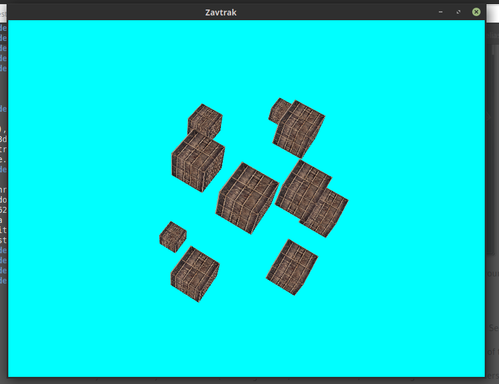
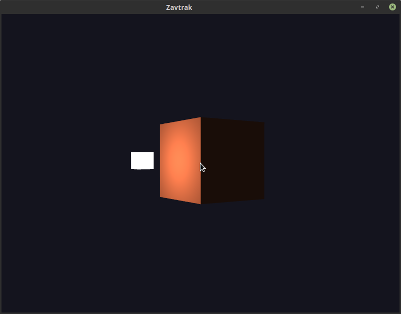
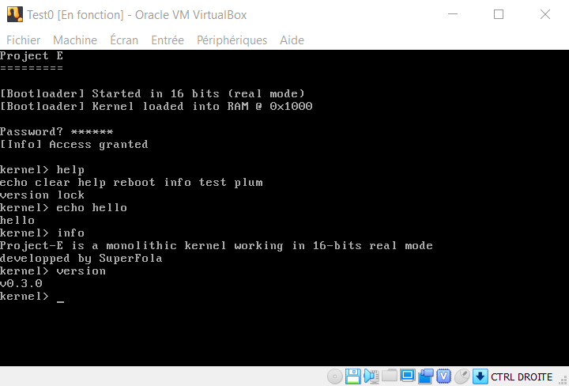

## [ArkScript](https://github.com/ArkScript-lang)

A lisp inspired scripting language made in C++.

Fibonacci function:
```clojure
(let fibo (fun (n)
    (if (< n 2)
        n
        (+ (fibo (- n 1)) (fibo (- n 2))))))

(print (fibo 28))  # display 317811
```

Closures with explicit capture:
```clojure
{
    (let countdown-from (fun (number)
        (fun (&number) {
            (set number (- number 1))
            number
        }))
    )
    (let countdown-from-3 (countdown-from 3))
    (print (countdown-from-3))
    (print (countdown-from-3))
    (print (countdown-from-3))
}
```

## [The Fate of Marcus](https://superfola.itch.io/the-fate-of-marcus)

A minecraft clone about exploration, where the player is trying to learn more about Marcus, someone who seems to be lost in space.


## [Zavtrak](https://gitlab.com/SuperFola/Zavtrak)

A library to simplify the use of OpenGL, used by The Fate of Marcus.





## [Project-E](https://github.com/SuperFola/project-E)

A small proof of concept of a 16 bits real mode "operating system", made using NASM assembly.



